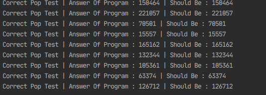
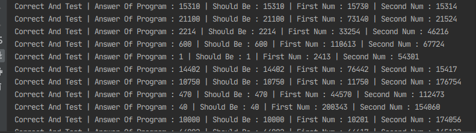

# CArchitecture_Tester_Ass3
A tester that I have written for assignment 3 of the Computer Architecture class in BGU 2021

This tester generates random data on the fly and proceeds to test different scenarios on the Unlimited precision calculator executable. 
Output from the executable is compared to what should of been outputted by your program.
This tester allows running thousands of randomly generated tests on your program in a minute.

---

Release Date : 20/05/21

Last update:
22/05/21 23:44

Added-
* Completely randomly generated tests that randomize the actions aswell (Till now each action was checked separately) 
* New test for a unique case that might be missed by many (Whenever we use complementary numbers with "and operation" proceeding with the "n" operation)
* New sanity tests according to the following : https://www.cs.bgu.ac.il/~caspl212/Forum/Forum_Assignment_2?action=show-thread&id=8c55fc260fddbc41569e9c20a102155d

----

To do:
Memory leak check

----

Known bugs:
Sometimes it might tell you that the tests have failed. (Because of read timeouts of console etc..) - Just rerun the tester a few times

How to use -
1) Import the files into your favourite java IDE 
2) Take your compiled ./calc binary and put it into the same folder of the project
3) Run the tester

Features-
1) Tests Add operation
2) Tests And operation
3) Tests N operation
4) Tests multiple pop and print operations
5) Tests params aka stack size param
6) Completly randomly generated tests that utilize Adding,And,N,pop and print
7) Tests dupe on a full stack
8) Tests dupe operation

